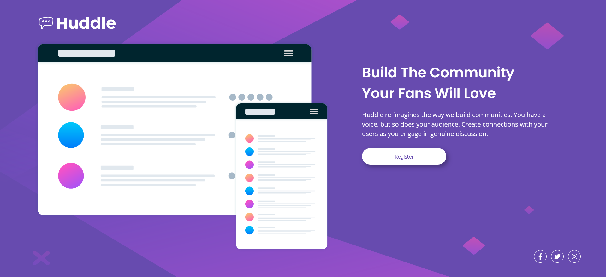

# Frontend Mentor - Huddle landing page with single introductory section solution

This is a solution to the [Huddle landing page with single introductory section challenge on Frontend Mentor](https://www.frontendmentor.io/challenges/huddle-landing-page-with-a-single-introductory-section-B_2Wvxgi0). Frontend Mentor challenges help you improve your coding skills by building realistic projects.

## Table of contents

- [Overview](#overview)
  - [The challenge](#the-challenge)
  - [Screenshot](#screenshot)
  - [Links](#links)
  - [Built with](#built-with)
  - [What I learned](#what-i-learned)
- [Author](#author)

## Overview

My challenge is to build out this landing page from the designs provided in the starter code.

### The challenge

Users should be able to:

- View the optimal layout for the page depending on their device's screen size
- See hover states for all interactive elements on the page

### Screenshot

### Links

- Solution URL: https://github.com/Gunner40/Huddle-landing-page-with-single-introductory-section
- Live Site URL: https://gunner40.github.io/Huddle-landing-page-with-single-introductory-section/

### Built with

- Semantic HTML5 markup
- CSS custom properties
- Flexbox
- CSS Grid
- Mobile-first workflow

### What I learned

Background images

- if background-size is set to COVER, the image will always cover the entire element and it will maintain its aspect ratio. However if necessary it may be CLIPPED, resulting in the whole image not being shown.

- if set to a PERCENTAGE, eg background-size: 100% 100%, the image will cover the entire element (or whatever percentage we specify, here its 100%) but may be stretched (if necessary). The whole image will be shown but the original aspect ratio might not be maintained resulting in a stretched (or squashed) image.

## Author

- Name - Paul Ryan
- Frontend Mentor - https://www.frontendmentor.io/profile/Gunner40
